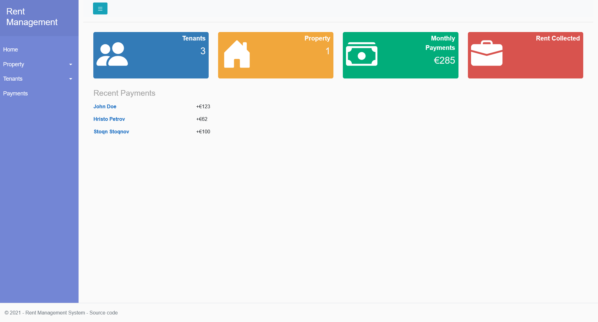
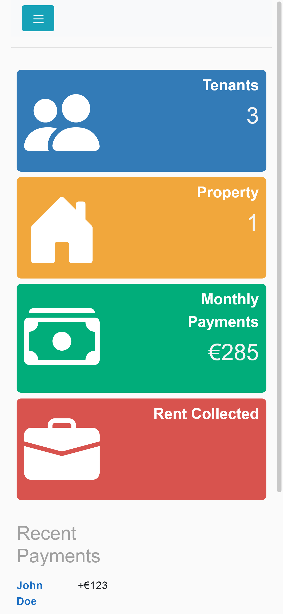

# Rent Management System

A simple and intuitive management system intended for landowners, who need to keep track of properties, tenants and payments.

Built in .NET 5.0 MVC with Entity Framework Core.

## Documentation

### Mobile view

